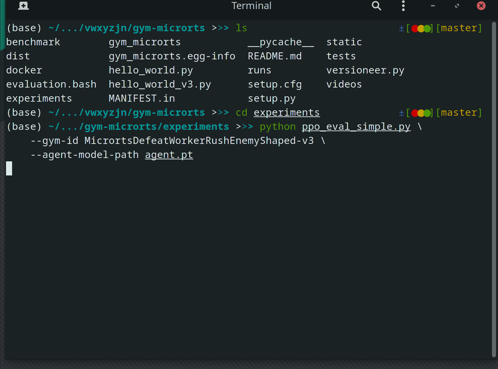

# Gym-μRTS (pronounced "gym-micro-RTS")

[](https://discord.gg/DdJsrdry6F)
[](
https://github.com/vwxyzjn/gym-microrts/actions)
[](
https://pypi.org/project/gym-microrts/)


This repo contains the source code for the gym wrapper of μRTS authored by [Santiago Ontañón](https://github.com/santiontanon/microrts). 


## Get Started

```bash
# Make sure you have Java 8.0+ installed
$ pip install gym_microrts --upgrade
```

And run either the `hello_world_v3.py` in this repo or the following file
```python
import numpy as np
import gym
import gym_microrts
import time
from gym_microrts.envs.vec_env import MicroRTSVecEnv
from gym_microrts import microrts_ai
from gym.envs.registration import register
from gym_microrts import Config

try:
    env = MicroRTSVecEnv(
        num_envs=1,
        render_theme=2,
        ai2s=[microrts_ai.coacAI],
        map_path="maps/16x16/basesWorkers16x16.xml",
        reward_weight=np.array([10.0, 1.0, 1.0, 0.2, 1.0, 4.0])
    )
    # env = gym.make('MicrortsDefeatCoacAIShaped-v3').env
    # env = gym.wrappers.RecordEpisodeStatistics(env)
    # env.action_space.seed(0)
    obs = env.reset()
    env.render()
except Exception as e:
    e.printStackTrace()
env.action_space.seed(0)
env.reset()
for i in range(10000):
    env.render()
    action_mask = np.array(env.vec_client.getUnitLocationMasks()).flatten()
    time.sleep(0.001)
    action = env.action_space.sample()

    # optional: selecting only valid units.
    if len(action_mask.nonzero()[0]) != 0:
        action[0] = action_mask.nonzero()[0][0]

    next_obs, reward, done, info = env.step([action])
    if done:
        env.reset()
env.close()
```

To train an agent against the built-in WorkerRushAI, run the following

```bash
python experiments/ppo.py \
    --gym-id MicrortsDefeatWorkerRushEnemyShaped-v3 \
    --total-timesteps 100000000 \
    --wandb-project-name gym-microrts \
    --capture-video \
    --seed 1
```

The run above will save a model at the models folder. In the experiment folder we 
provided a trained model. Run the following to evaluate the agents

```bash
python ppo_eval_simple.py \
    --gym-id MicrortsDefeatWorkerRushEnemyShaped-v3 \
    --agent-model-path agent.pt
```

which will look like the following




## Environment Specification

Here is a description of Gym-μRTS's observation and action space:

* **Observation Space.** (`Box(0, 1, (h, w, 27), int32)`) Given a map of size `h x w`, the observation is a tensor of shape `(h, w, n_f)`, where `n_f` is a number of feature planes that have binary values. The observation space used in this paper uses 27 feature planes as shown in the following table. A feature plane can be thought of as a concatenation of multiple one-hot encoded features. As an example, if there is a worker with hit points equal to 1, not carrying any resources, owner being Player 1, and currently not executing any actions, then the one-hot encoding features will look like the following:

   `[0,1,0,0,0],  [1,0,0,0,0],  [1,0,0], [0,0,0,0,1,0,0,0],  [1,0,0,0,0,0]`
   

    The 27 values of each feature plane for the position in the map of such worker will thus be:
    
    `[0,1,0,0,0,1,0,0,0,0,1,0,0,0,0,0,0,1,0,0,0,1,0,0,0,0,0]`

* **Action Space.** (`MultiDiscrete([hw   6   4   4   4   4   7 hw])`) Given a map of size `h x w`, the action is an 8-dimensional vector of discrete values as specified in the following table. The first component of the action vector represents the unit in the map to issue actions to, the second is the action type, and the rest of components represent the different parameters different action types can take. Depending on which action type is selected, the game engine will use the corresponding parameters to execute the action. As an example, if the RL agent issues a move south action to the worker at $x=3, y=2$ in a 10x10 map, the action will be encoded in the following way:
    
    `[3+2*10,1,2,0,0,0,0,0 ]`


## Preset Envs:

Gym-μRTS comes with preset environments for common tasks as well as engaging the full game. Feel free to check out the following benchmark:

* [Gym-μRTS V1 Benchmark](https://wandb.ai/vwxyzjn/action-guidance/reports/Gym-microrts-V1-Benchmark--VmlldzozMDQ4MTU)
* [Gym-μRTS V2 Benchmark](https://wandb.ai/vwxyzjn/gym-microrts/reports/Gym-microrts-s-V2-Benchmark--VmlldzoyNTg5NTA)
* [Gym-μRTS V3 Benchmark](https://wandb.ai/vwxyzjn/rts-generalization/reports/Gym-microrts-V3-Environments--VmlldzoyNzQwNzM)


Below are the difference between the versioned environments

|    | use frame skipping | complete invalid action masking            | issuing actions to all units simultaneously | map size |
|----|--------------------|--------------------------------------------|---------------------------------------------|----------|
| v1 | frame skip = 9     | only partial mask on source unit selection | no                                          | 10x10    |
| v2 | no                 | yes                                        | yes                                         | 10x10    |
| v3 | no                 | yes                                        | yes                                         | 16x16    |


## Developer Guide

Clone the repo

```bash
# install gym-microrts
$ git clone --recursive https://github.com/vwxyzjn/gym-microrts.git && \
cd gym-microrts && \
pip install -e .
# build microrts
$ cd gym_microrts/microrts && bash build.sh && cd ..&& cd ..
$ python hello_world.py
```

## Known issues

[ ] Rendering does not exactly work in macos. See https://github.com/jpype-project/jpype/issues/906


## Papers written using Gym-μRTS

* Comparing Observation and Action Representations for Deep Reinforcement Learning in MicroRTS (https://arxiv.org/abs/1910.12134)
    * Logged experiments https://app.wandb.ai/costa-huang/MicrortsRL


